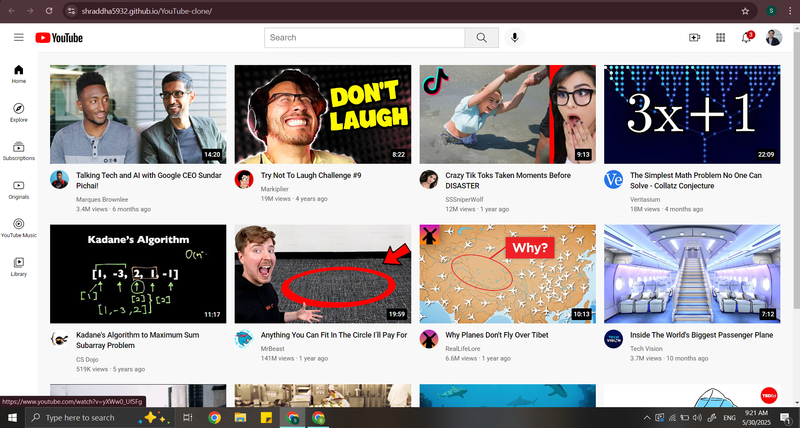

# YouTube Clone 🎥

A simple front-end clone of YouTube built using **HTML** and **CSS**. This project is designed for practice and learning purposes to improve my web development skills.

## 🌐 Live Demo

👉 [Click here to view the project](https://shraddha5932.github.io/YouTube-clone/)

## 📸 Screenshots

 Home Page 
 
  

## 🛠️ Built With

- HTML5
- CSS3
- Flexbox
- Grid
- Responsive Web Design

## 📌 Features

- YouTube-style layout with:
  - Header navigation bar
  - Sidebar menu
  - Responsive video grid layout
- Hover effects for better UI experience
- Clean and modern design inspired by YouTube

## 🚀 How to Use Locally

```bash
git clone https://github.com/Shraddha5932/YouTube-clone.git
cd YouTube-clone
open index.html
